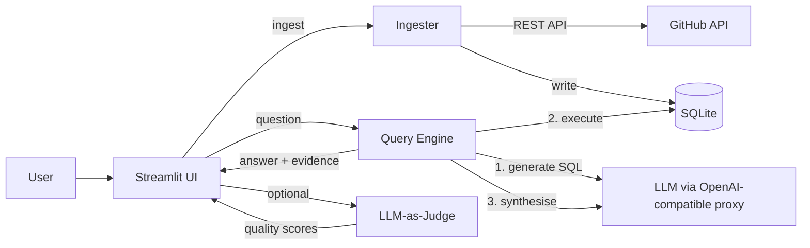

# GitHub Insights Assistant

A Streamlit app that answers natural-language questions about GitHub repositories via grounded NL→SQL. Every answer is backed by auditable SQL and clickable evidence links.

## Architecture



## Scope & Tool Choices

| Choice | Rationale |
|--------|-----------|
| **SQLite** | Zero-config, file-based, fast for demo scale (default as200 items/repo but changeable in UI) |
| **OpenAI-compatible proxy** | Flexible and can adapt to different api keys. |
| **Streamlit** | Rapid prototyping, built-in widgets for progress/metrics/dataframes |
| **NL→SQL (no embeddings)** | Deterministic, auditable, fast|

## Data Retrieval & Preparation

1. **Ingester** (`ingester.py`) fetches via GitHub REST API:
   - `GET /repos/{owner}/{repo}` → repo metadata (stars, forks, language)
   - `GET /repos/{owner}/{repo}/issues?state=all` → issues + PRs (unified, distinguished by `is_pr` flag)
2. Handles rate limits (checks `X-RateLimit-Remaining`, sleeps until reset) and retries (exponential backoff on 403/429/5xx).
3. Writes to SQLite (`data/github.db`) with `INSERT OR REPLACE` for idempotent re-runs.
4. Body text truncated to 500 chars; labels stored as JSON array.

**Default repos:** `fastapi/fastapi`, `pydantic/pydantic` (200 items each).

## How Users Interact

1. **Sidebar** — configure repos, trigger ingestion with progress bar, view DB stats, use quick-insight buttons.
2. **Main panel** — type a natural-language question, optionally filter by repo via multiselect.
3. **Answer display** — synthesised markdown answer, expandable SQL panel, evidence table with clickable GitHub URLs.
4. **LLM-as-judge** (optional toggle) — scores groundedness, completeness, and citation quality (1–5 each).

## Output Quality Assessment

- **SQL safety validation**: rejects non-SELECT/WITH queries, blocks unsafe keywords, rejects semicolons (no multi-statement injection).
- **Grounding**: every answer is synthesised strictly from query results; SQL is surfaced for manual audit.
- **Evidence links**: raw data rows with GitHub URLs displayed alongside the answer when possible and meaningful.
- **LLM-as-judge**: optional evaluator scores each answer on groundedness, completeness, and citation quality with explanatory notes.

## Known Limitations

- **No embeddings** — paraphrased or vague questions may produce poor SQL - LLM as a judge helps understanding these limitations and gives potential improvement recommendation to the user.
- **Single-turn** — no conversation memory; each question is independent.
- **No comments/reviews** — only issue/PR metadata is ingested.
- **LLM-dependent** — quality depends on the backing model; proxy must be configured correctly.

## Next Improvements

- Comments & PR reviews ingestion
- Multi-turn conversation memory
- LLM-as-judge eval over a golden question set (automated regression)
- Response caching by (question, db_hash)
- Add visualisation for some queries where useful. For example; "plot the number of issues per day", generates sql + generates matplotlib and displays

## Run Instructions

### Prerequisites

- Python 3.11+
- A GitHub personal access token
- An OpenAI-compatible API endpoint (Azure, LiteLLM, direct OpenAI, etc.)

### Setup

```bash
# Clone and enter the repo
git clone <repo-url> && cd cauchy-assingment-e

# Create virtual environment
python3 -m venv .venv && source .venv/bin/activate

# Install dependencies
pip install -r requirements.txt

# Configure environment
cp .env.example .env
# Edit .env and fill in:
#   GITHUB_TOKEN=ghp_...
#   OPENAI_API_KEY=sk-...
#   OPENAI_BASE_URL=https://your-proxy.example.com/v1
#   OPENAI_MODEL=azure.gpt-5.1  (or any model your proxy supports)
```

### Run

```bash
# Option A: Ingest via CLI, then launch UI
python3 ingester.py
streamlit run app.py

# Option B: Ingest from the Streamlit sidebar (click "Ingest Repos")
streamlit run app.py
```

### Quick test (CLI)

```bash
# Verify ingestion
sqlite3 data/github.db "SELECT count(*) FROM issues;"

# Ask a question programmatically
python3 -c "
import asyncio
from query_engine import ask
result = asyncio.run(ask('How many open PRs does fastapi have?'))
print(result.text)
print(result.sql)
"
```
